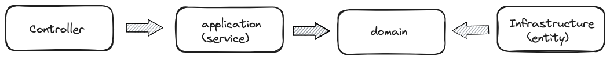

# 레이어 아키텍처

1. 레이어 아키텍처 종속성 흐름
- 이야.. 분석을 하면서 실로 놀라웠다. 레이어 아키텍처가 결국 데이터이스 관점인거는 알았지만 실제로 분석해보니 너무나도 데이터에서 의존적일수 밖에 없다.
- 실제로 그려서 충격 그자체다... 데이터베이스 너무나 의존적이라니..? 이러면 결국 데이터베이스가 변경되면 모든 전반적인 부분에 영향이 갈 것이다.
- 아래는 실제 종속되는 방향을 그린 그림이다. 

- 충격적이게도 서비스와 도메인이 데이터베이스에 의존하고 있다. 이러면 데이터베이스가 자주 바뀌거나 신규 기능이 추가될때 마다 영향도가 너무나도 클거 같다.
- 또한 비지니스 로직이 중요한게 아니라 데이터베이스 설계가 더 중요해지게 된다.(?)
- 그런데 또 원래 설계 분석하게 되면, 기획서를 통해 비지니스 로직 -> 도메인 -> 디비설계(???) 또 이렇게 보면 레이어드 아키텍처 흐름과 똑같이 흘러가게 된다. 
- 레어이드 아키텍처의 큰 특징중 하나인 관심사의 분리! 인터페이스와 JAVA Solid 규칙을 적절히 사용하여 관심사의 분리를 구현한다.
- 관심사의 분리는 결국 종속성을 의미하는게 아닐까 싶다. 도메인 계층은 어플리케이션 계층이 무엇을 하는지 몰라도 된다. 그말은 결국 의존한다라는 생각이다. 다만 의존 방향이 한방향으로 가야된다는 룰을 지켜야지만..
- 정리를 해보면, 레이어드 아키텍처는 레이어란 계층 구조를 아래와 같이 나눈다.
[프레젠테이션 계층] -> [애플리케이션 계층] -> [도메인 계층] -> [인프라 계층(데이터베이스)]
계층 구조를 나누고 의존방향을 아래로 향하게 하여 관심사의 분리를 이행한다.
- 또한 내 생각으로는 기획 분석을 통해 '비지니스 로직 -> 도메인 -> 디비설계' 비슷한 구조로 분석하기 때문에 계층 구조 또한 비슷한 흐름으로 이어가지 않았을까 싶다.
- 큰 단점으로는 관심사의 분리를 통해 각 계층에 집중을 할 수 있지만?, 도메인이 변경되면 테이블 변경 부터 비지니스 로직 변경까지 확인해야될 부분과 변경되는 부분이 많아진다.
- 그리고 규모가 커지면 복잡도, 유지보수, 테스트, 배포 등이 점점 어려워진다.(사실 이부분도 모놀리식일때 발생하는 것 같다.)
- 장점은? 구조 자체가 간단하기 때문에 분석이 쉽고, 빠르게 개발할 수 있다.
- 위 내용은 지금까지 내가 알던거를 정리해봤는데 왜 소프트웨어 구조 설계가 점점 진화하는지를 깨닫게 되는 스타트지점인거 같다. 프로젝트를 설계해보고 직접 변경되는 부분을 시나리오를 통해 느껴봐야겠다.

2. 레이어드 아키텍처 종속성 흐름을 조금 바꾼다면?
- 헥사고날, 클린아키텍처와 같이 DDD(도메인주도개발)를 적용할 수 있지 않을까 생각해봤다.
- 아래 그림처럼 도메인에 집중되게 종속방향만 바꿔주면 되는거 아닐까? 그러면 레이어 구조도 도메인 구조 설계가 가능한 부분이 아닐까 생각이 든다.

- 막연하게 저렇게 바뀌어서 구현한다고 생각해보니 어떻게 해야될지는 모르겠다. 한번 저렇게 했을때 개발이 잘될지 한번 해봐야겠다.
