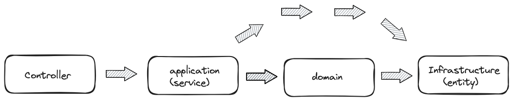
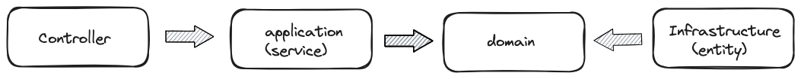

# 설계패턴1, 레이어드 아키텍처1

1. 레이어드 아키텍처란?
- 레이어드를 한국어로 표현하면 '계층 아키텍처', 즉 계층화된 아키텍처로 시스템을 몇 개의 계층으로 나누어 각 계층이 특정 책임이나 역할 수행하도록 하는 아키텍처
- 각 계층은 담당하는 특정 책임과 역할이 다르게 설계하여 계층화한다. 이는 각 계층이 담당하는 역할이나 관심사가 분리되어 있는 의미로 '관심사의 분리'를 의미한다.
    
- 이러한 계층이 담당하는 책임과 역할을 분리함으로서 각 계층들은 어떻게 보면 응집도를 높이는 구조로 볼수 있어서 유지보수나 테스트가 쉽다.
- 레이어드는 n개의 계층으로 나누는데 보통은 4계층으로 나눈다.
    - 프레젠테이션 계층(Presentaion Layer) : 프레젠테이션 계층은 사용자 인터페이스, 즉 UI를 다루는 계층이다. 
    - 비지니스 로직 계층(Business Logic Layer) :  주로 비지니스 로직을 다루는 계층으로 어디서 데이터를 가져오고 저장하는지 혹은 어디서 보여주는지는 관심이 없다. 데이터베이스와 직접 상호작용하지 않고 엑세스 계층에 의존하여 데이터를 처리한다.
        (레이어드에서 이부분이 제일 중요하다고 생각한다. 비지니스 로직은 도메인와 밀접하게 관련이 있는데, 이 도메인들은 데이터베이스 구성하는 부분과도 매우 밀접하게 관련이 있다. 그러다 보니 보통 데이터베이스 구성을 염두해두고 비지니스 로직을 설계한다.
        이 부분이 레이어드 계층에서 제일 어려운 부분 같다. 난 비지니스 로직와 데이터베이스 구성은 밀접하게 구성하되 완전히 분리되어야 한다고 생각한다.)
    - 데이터 엑세스 계층(Data Access layer) : 도메인 계층으로 비지니스 로직을 처리후 영속성을 구현하기 위한 계층이다. (구조상 데이터베이스 CRUD를 하는 역할이다.)
    - Database Layer(Database Layer) : 물질적으로 데이터베이스 서버를 의미한다.
    
2. 레이어드 아키텍처 특징
    - 레이어드 아키텍처의 가장 특징적인 부분은 계층화된 구조이다. 이 계층화된 구조로 인해 계층간 의존성과 상하위 계층간 추상화 수준이 높아진다. 또한 계층 구조를 모듈구조로 하여 독립적으로 개발 및 테스트를 진행할 수도 있다.
    - 레이어드 아키텍처의 의존 방향은 하위 계층으로만 의존한다. 이 말 뜻은 레이어간 역할이 명확하다는 의미이다. 
        - ex)
        ~~~ java
        
            /**
             * 프레젠테이션 계층
             */
            @RestController
            @RequireArugmentConstruct
            public class TestApi {

                private final TestService testService;

                @GetMapping
                public void print() {
                    // 프레젠테이션 계층에서는 TestService.print() 함수가 어떻게 구성했는지는 알필요가 없다.
                    // 그저 어떤 Print()를 하는것만 알면 된다.
                    testService.print();
                }
            }

            public interface TestService {
                void testService();
            }

            /**
             * 비지니스 로직 계층 
             * 비지니스 로직 계층에서는 TestApi.class의 존재 자체를 모른다. 알 필요가 없기 때문에..
             */
            @Service
            public class TestServiceImpl implements TestService {
                @Override
                public void testService() {
                    // 일련의 비지니스 로직 작업
                }
            }
        ~~~
    - 레이어간 역할이 명확하다는 의미는 다르게 말하면 레이어들을 한 프로젝트가 아닌 모듈별로 구성하여 분리해서 관리를 할 수 있다는 의미가 내포된다.
    - 또한 이를 DIP를 이용하여 계층간 느슨한 의존성을 유지하며 추상화 수준을 높일 수 있다.

4. 레이어드 아키텍처 내생각 정리
    - 허허.. 나는 실제 레이어드 아키텍처를 사용은 해왔지만 고민은 해보지 않았다. 고민할 필요성도 없었고, 프로젝트를 진행할때는 가장 빠르게 개발할수 있는 아키턱처였기 때문이다.
    - 이후 레이어드 아키텍처를 조사하고 생각을 정리 하던 중 레이어드 아키텍처의 패러다임을 뛰어넘는 아키텍처는 아직 나오지 않는 것 같다.
    - 이유는 총 4가지 정도이다.
        1. 레이어드도 결국 각 계층간 의존성을 명확히 지킨다면 클린, 헥사고날 특징을 가진다.
        
        2. Spring IOC, DI의 출현으로 레이어드 아키텍처에서 여러 아키텍처 패턴들이 파생됬다.
        3. 레이어드 아키텍처를 재대로 사용하는 프로젝트가 있을까?
        4. 도메인 계층 != 데이터 엑세스 계층
    - 2번의 등장으로 1,2번을 통해서 클린, 헥사고날 패턴들이 파생됬다. 기존에는 의존성을 직접 주입했어야 했지만 스프링의 등장으로 여러 패턴들이 등장할 수 있는 발판이 된 것이다.
    - 3,4번은 잘 생각해보면 비지니스 로직을 구성하는 부분중 하나가 도메인이다. 그러다보니 비지니스 로직 계층에서 도메인을 통해 데이터 엑세스 계층의 데이터를 만들고 저장을 해야 한다. 어떻게 저장하는지는 중요치 않다.
    - 3,4번 부분이 제일 어려운 점인것 같다. 어디까지 허용할 것인가? <- 이점 때문에 코드량이라던지 가독성등 여러 부분에서 아마 제약이 생길수도 있고 생산량이 떨어질수도 있을 것이다.
    - 내가 지금까지 했던 프로젝트들은.. 결국 잘못된 방향으로 진행됬을 뿐더러 이제까지 했던 것들은 무었이었을까? 천천히 조금식 바꿔나가자 ㅠㅠㅠㅠㅠㅠ