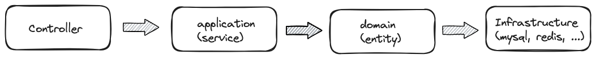
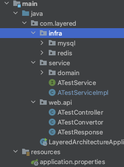
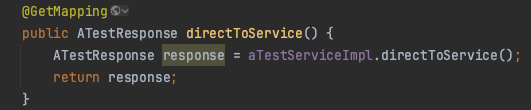
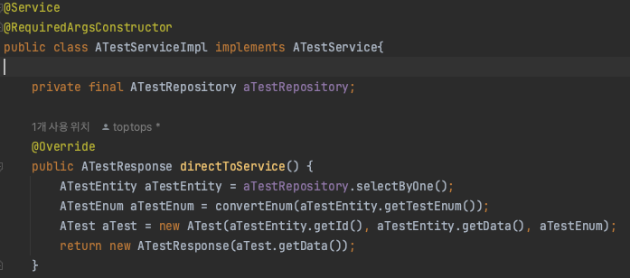

# 설계패턴1, 레이어드 아키텍처2

## 문제점1
- 실제 프로젝트 구조를 생각하면서 구현중에 지금까지 내가 했던 방식이 맞았나? 의문이 들기 시작헀다.
- 아래 이미지를 보면 

레이어드 아키텍처 의존 방향은 한방향으로 흘러야 한다라고 알고 있다. 그런데 실상 코드를 짜보면 이러한 규칙들이 잘안지켜진다는걸 알수있었다.
- 아래는 간단한 Controller-Service 예시이다.
    - 패키지 구조
    
    - Controller
    
    - Service
    
- 위 사진을 보면 서비스에서 프레젠테이션 계층 ATestResponse에 직접적으로 의존하고 있다(?). 사실 지금까지 내편의성을 위해서 저런방식으로 구현해왔다. 허허..? 모놀리식이고 모듈구조로 변경된다고 하더라도 실질적으로 완벽히 분리되지 않아서 발생한 문제다.
- 그러면 '어떻게 구현을 해야될까?' 고민을 많이 해보았다. 패키지 구조를 보면 Convertor라는 서비스 클래스를 만들어서 단순 변환 작업을 해줘야 하는걸까? 아니면 컨트롤러에서 가져와서 응답객체를 만들어야 할까?
- 정답은 없는것 같지만 서비스를 하나 더만들어서 리턴해주는게 제일 깔끔할것 같다. 클래스 하나더 만드는게 부담일수도 있겠지만 복잡한 도메인이나 응답문일수록 가독성을 위해서라면 하나더 만드는게 이득이라고 판단이 된다.

## 문제점2
- 위 문제점1처럼 패키지구조에 따라 각각 계층마다 의존성을 지켜야한다. 하지만 의존성을 지키다보면 발생하는 문제는 저장소를 다양하게 구성하거나 변경이 힘들다는 문제점이 있다.
- 헥사고날을 이미 알고있다보니 DIP를 이용해 느슨하게 의존성을 유지하며 의존 방향을 바꾸거나 결합도를 높이면 된다. 
- 의존방향을 바꾸는 방법은 레이어드 전제가 깨진다. 결합도를 높이면? 유지보수가 나중에 힘들어진다. 
- 음... 난 사실 이부분에 대해서는 레이어드 전제조건 지키는게 맞다고 본다. 의존방향을 바꾸면 유지보수는 쉬워지지만 레이어드 아키텍처 규칙을 지키는게 혼란을 주는것보다 나을것 같다.(팀내 규칙을 따르자!)

## 결론
- 모놀리식 패지키 구조에선 레이어드 모델은 요정도 까지 정리할수 있을것 같다.
- 생각보다 난 재대로된 규칙도 없고 구성 생각안하고 내마음대로 했고 지키고 있다고 생각했지만 의외로 이런 부분들을 고려안하고 계속 개발을 해오다보니 뭔가 예속되버린 느낌이다.
- 다행히 이러한 공부와 생각을 통해 좀더 유지보수와 나은 구조를 생각해서 구현할수 있을것 같다.
